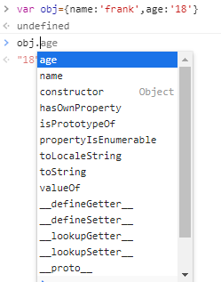
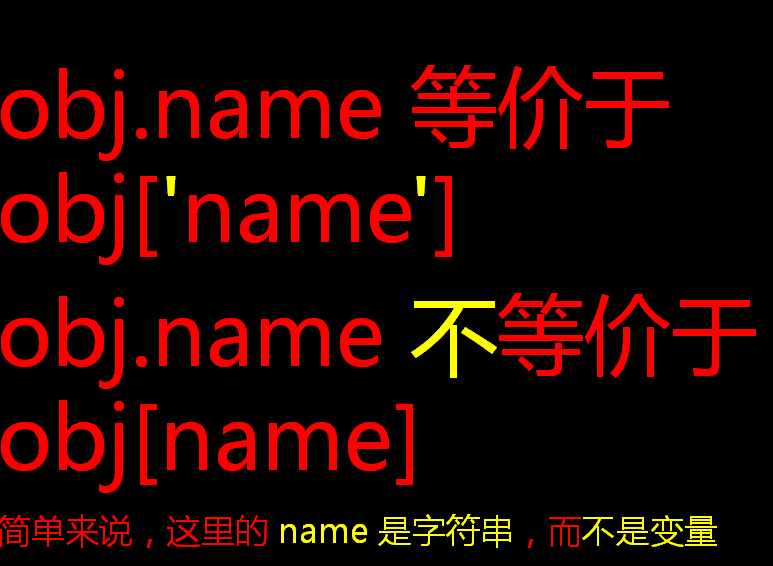

# JS对象

## 定义

JS对象是一种无序的数据集合，也是键值对的集合

#### 键值对

如 `'name': 'frank'`，name就是键（key），frank就是值

#### 写法

`let obj = { 'name': 'frank', 'age': 18 }`（多数使用）

`let obj = new Object({'name': 'frank'})`（正规写法）

`console.log({ 'name': 'frank, 'age': 18 })`

#### 注意

- 键名是字符串，不是标识符，可以包含任意字符
- **属性名引号可省略**，省略之后就只能写标识符（别写一写奇奇怪怪的东西，正常的a、b、c，123等标识符即可）
- **就算引号省略了，键名也还是字符串（重要）**

---

## 属性名（property）、属性值（value）

每个键（key）都是对象的属性名，每个value都是对象的属性值

#### 奇怪的属性名

所有属性名会自动变成字符串

`let obj = {`

  `1: 'a',`

  `3.2: 'b',`

  `1e2: true,`

  `1e-2: true,`

  `.234: true,`

  `0xFF: true`

 `};`

 `Object.keys(obj)`

 `=>`

 `["1", "100", "255", "3.2", "0.01", "0.234"]`

**细节**

 **Object.keys(obj)** 可以得到 obj 的所有 key

#### 变量作属性名

前面用到的都是直接在var或let的｛｝中直接创建key，那么如果用使用一个变量作为属性名呢？

`var a='name'`

`var obj={`

​       `'a':222`

`}`

=》

`Object.keys(obj)`

`["a"]`

如果使用以上代码，将a直接套入var obj中，那么a仅仅是一个字符串，与第一行代码中的a不相关。正确的做法是天上[ ]：

`var a='name'`

`var obj={`

​       `[a]:222`

`}`

=》

`Object.keys(obj)`
`["name"]`

加了 [ ] 则会当做变量求值,属性名就变成了name

#### 对象的隐藏属性

JS 中每一个对象都有一个隐藏属性（prototype），这个隐藏属性储存着其共有属性组成的对象的地址。这个共有属性组成的对象叫做原型。

也就是说，隐藏属性储存着原型的地址。

例子：

`var obj = {}`

`obj.toString()` 

`=》`

`"[object Object]"`

obj的隐藏属性上有toString()，因此可以调用

---

## 增删查改

#### 删除属性

**delete obj.xxx 或 delete obj['xxx']**

即删除obj的xxx属性（将属性连根拔起）

例子：

```javascript
var obj2 = {name:'frank', age:'18'}
delete obj.name
obj
=》
{age: "18"}
```

- **查看属性是否删除成功**

`'xxx' in obj === false`

例子：

```javascript
'name' in obj    //意为name在不在obj里

=>

false   // 反馈为：name不在obj中
```


- **查看一个obj 中  含有属性名，且属性值为undefined的属性名**

`'xxx' in obj && obj.xxx === undefined`

例子：

```javascript
var obj = {name:'frank',age:'18'}

obj.name= undefined //将name属性值变成undefined

'name' in obj && obj.name

//即：先询问name在不在obj中，再查询name

=》

undefined //结果为undefined，即name的属性值为undefined
```

- **注意！**

`obj.xxx === undefined` 并不能断定 'xxx' 是否为obj的属性，所以在查询属性值为undefined的属性名时，会加上 `'name' in obj &&` 再执行

---

#### 查看所有属性（读属性）

- **查看自身所有属性名**

`Object.keys(obj)`

- **查看自身所有属性值**

`Object.values(obj)`

- **查看自身所有属性值+属性名**

直接输入对象obj

或

`Object.entries(obj)`

- **查看共有属性**

  `console.log(obj.__proto__)`

- **查看自身属性+共有属性**

​       console.dir(obj)

​       或

​       Object.keys(obj) 查找_ proto _


​       或

​        obj. 等待跳出选项（**不推荐**）




- **判断一个属性是自身的还是共有的**

   ```javascript
   obj.hasOwnProperty('toString')
    =》
        false
   ```

 说明toString不是自己的而是共有的

 **'name' in obj和obj.hasOwnProperty('name') 的区别**

  `'name' in obj` 指name属性是否在obj中

  `obj.hasOwnProperty('name'`) 指查看name是共有属性还是自有属性

---

#### 原型

- **每个对象都有原型**

​      原型里存着对象的共有属性

​      如 obj 的原型就是一个对象

   `   obj.__proto__` 存着这个对象的地址

​      这个对象里有 `toString / constructor / valueOf` 等属性

- **对象的原型自身也是对象**

  查看方法：

  进入 **对象的原型** 的原型

  `console.log(obj.__proto__.__proto__)`

  =》

  `null`

  **对象的原型** 的原型是空

​       obj = {} 的原型即为所有对象的原型

​       这个原型包含所有对象的共有属性，是对象的根

​       这个原型也有原型，是 null

---

#### 查看属性

**方法**

- 中括号语法：`obj['key']`（优先使用）（这里的key表示属性） 
- 点语法：`obj.key`

​    坑新人语法：`obj[key]` // 把好好的字符串 'key'变成了变量



**区分:        obj.name \ obj.['name'] \ obj.[name]** 

​                 **前两者相同，后者name是变量**

---

#### 修改或增加属性

**直接赋值**

```javascript
let obj = {name: 'frank'} // name 是字符串

obj.name = 'frank' // name 是字符串
obj['name'] = 'frank' 
obj['na'+'me'] = 'frank'
let key = 'name'; obj[key] = 'frank'

obj[name] = 'frank' // 这是错的，这使得name变成了变量，值也变得不确定
let key = 'name'; obj.key = 'frank' // 这是错的，因为 obj.key 等价于 obj['key']

   ```

操作如下：


**批量赋值**

​```javascript
let obj = {name: 'frank'}
Object.assign(obj, {age: 18, gender: 'man'})
   ```

---

#### 修改或增加共有属性

**无法通过自身修改或增加共有属性，共有属性不支持这点**

`let obj = {}, obj2 = {}` 

两者共有 toString，我们来修改obj的toString：

`obj.toString = 'xxx'` 

 obj 属性被修改了

 但obj2.toString 还是在原型上

 我们可以得出：某个obj只会改自身属性，其他的obj的共有属性还是在原型上

**执意要修改**

`obj.__proto__.toString = 'xxx'` （极度不推荐此方！！）

或

`Object.prototype.toString = 'xxx'` 

不要修改原型，会出现很多问题

---

#### 修改隐藏属性

使用 Object.create

```javascript
let common = {kind: 'human'}
let obj = Object.create(common)
obj.name = 'frank'
```

obj无需提前赋值，`let obj = Object.create(common)`会让obj.name的属性值变空

具体看：


## 原型链


图中的`__prototype__：Object`是对象common的共有原型

内存图为：

 